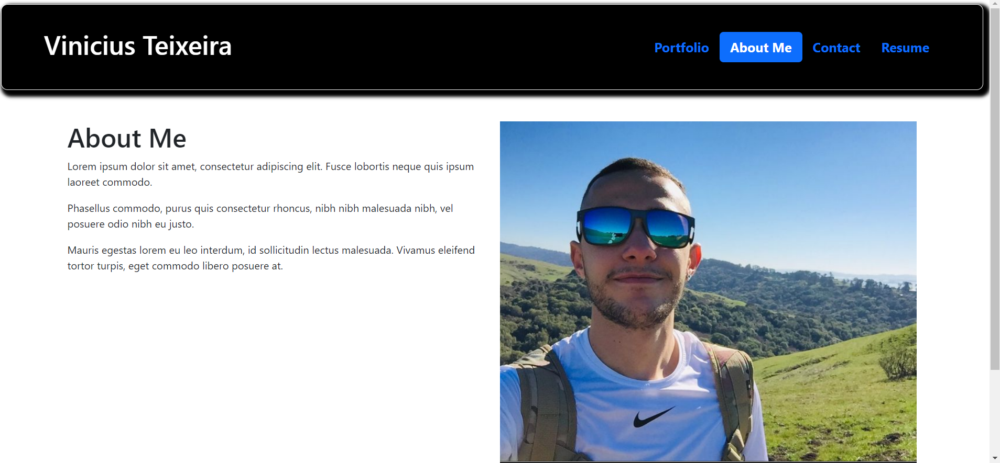
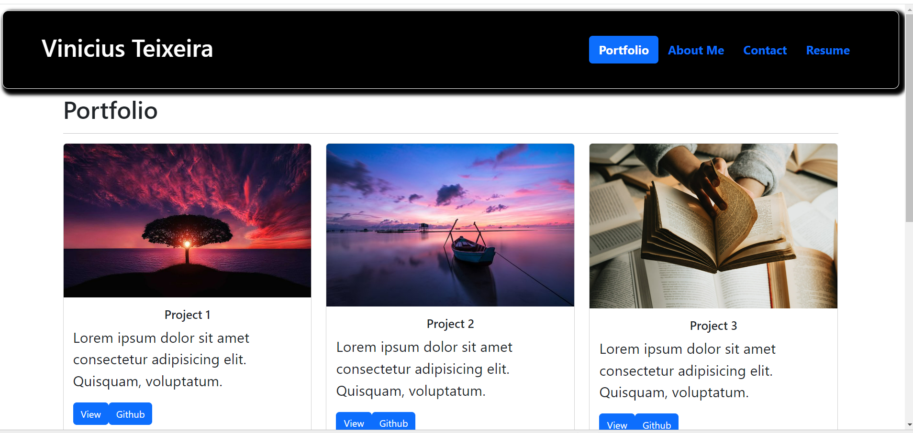

# Portfolio ✨✅
React Portfolio


## Description

```
This is a portfolio created using React. It is a single page application that uses React components to render the page. 
It is a responsive application that can be viewed on any device. It contains a navbar, a header, a footer, and a main section. 
The main section contains a card for each project that I have completed. 
Each card contains a screenshot of the project, a description of the project, and links to the deployed application and the GitHub repository.
 The footer contains links to my LinkedIn profile, my GitHub profile, and my resume. 
```

## Table of Contents

* [Installation](#installation)
* [Usage](#usage)
* [Questions](#questions)

## Installation

```
npm install
npm start
npx create-react-app
npm instal react-bootstrap
npm install bootstrap
npm install font-awesome
```

## Usage

```
This application is used to display my portfolio. It can be viewed on any device.
```

## Questions

If you have any questions, please contact me at  - Vinícius Teixeira | [Vinni99](https://github.com/Vinni99)

## Links

* [GitHub Repository](https://github.com/Vinni99/Portofolio.git)
* [Heroku Deployed Application]()

## Screenshots





test